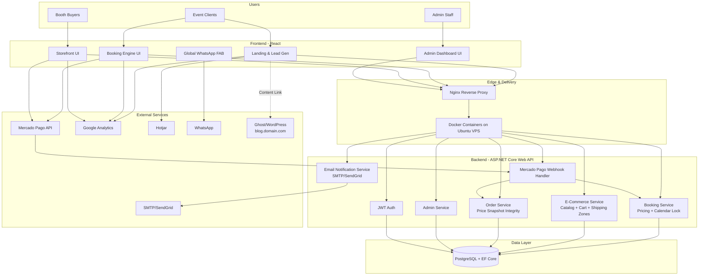

# DJVrstl System Design

## High-Level Architecture Diagram

## Key Business Rule Flows

1. **Booking lock flow**: checkout attempt locks selected date for 15 minutes; webhook-confirmed deposit blocks whole day.
2. **Geofenced shipping flow**: ZIP code determines Zone 1 (free), Zone 2 (flat fee), or Zone 3 (disable checkout and route to WhatsApp quote).
3. **Order integrity flow**: order line items store immutable purchase-time price snapshots.
